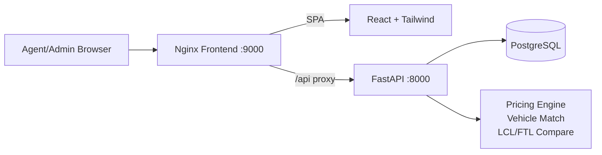
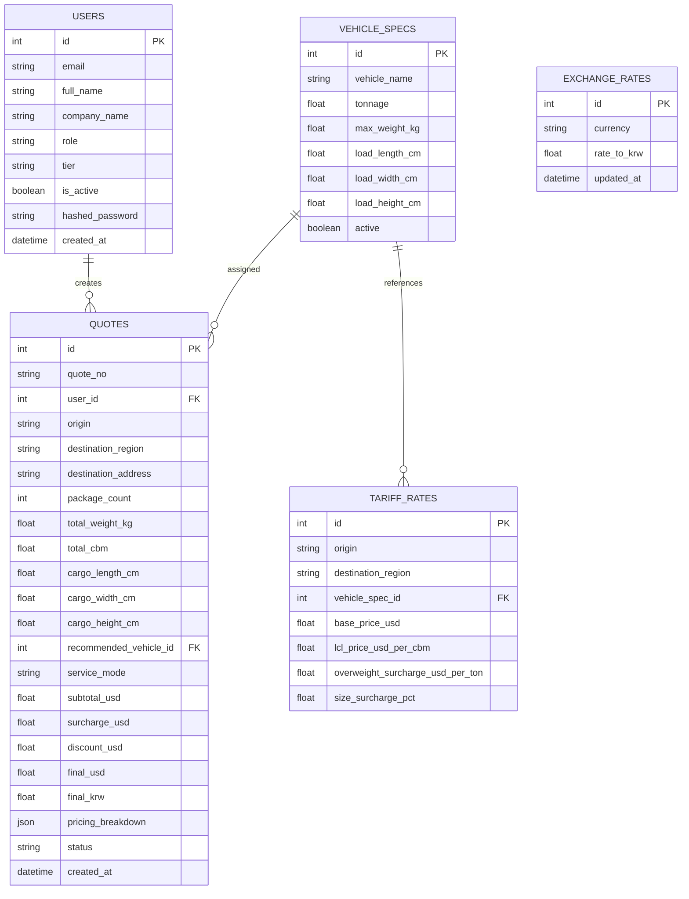
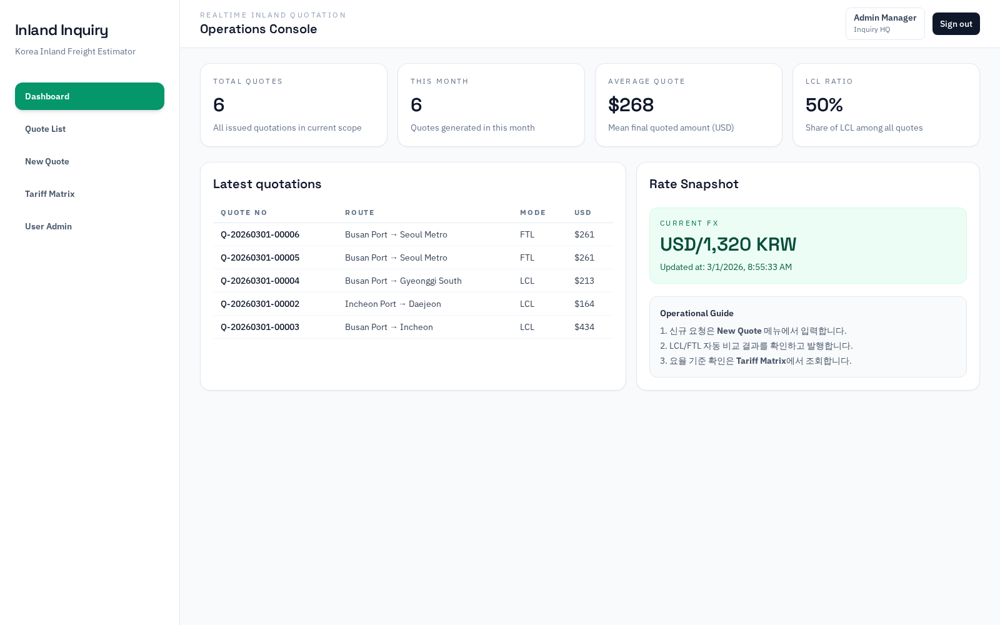
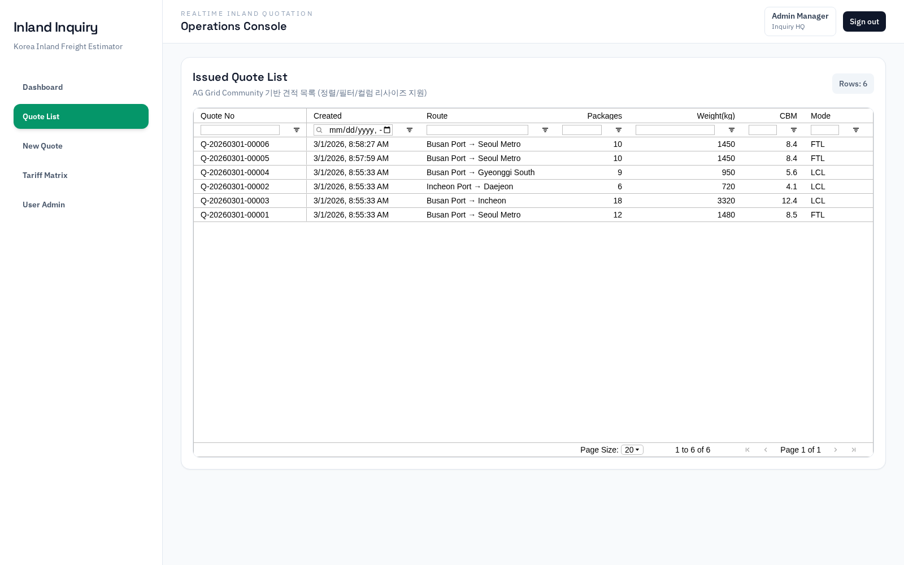
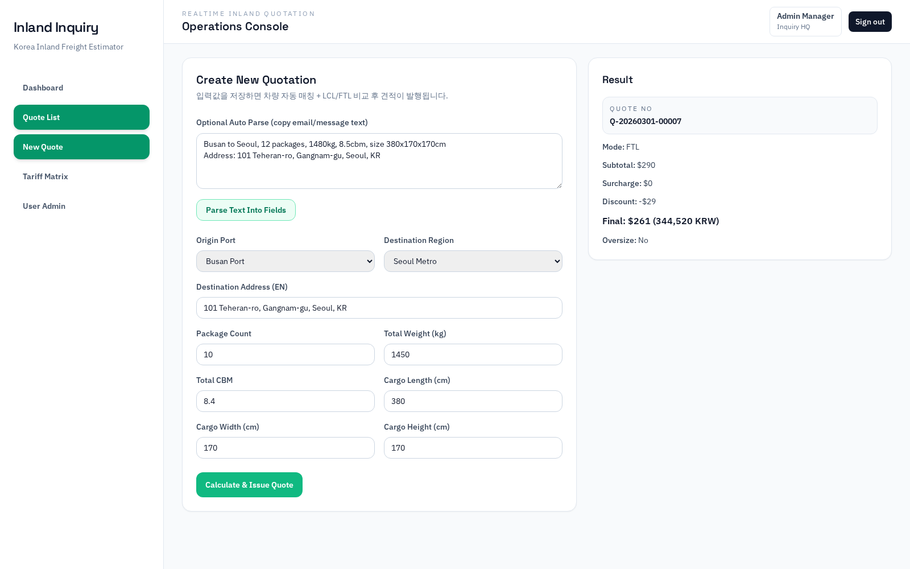
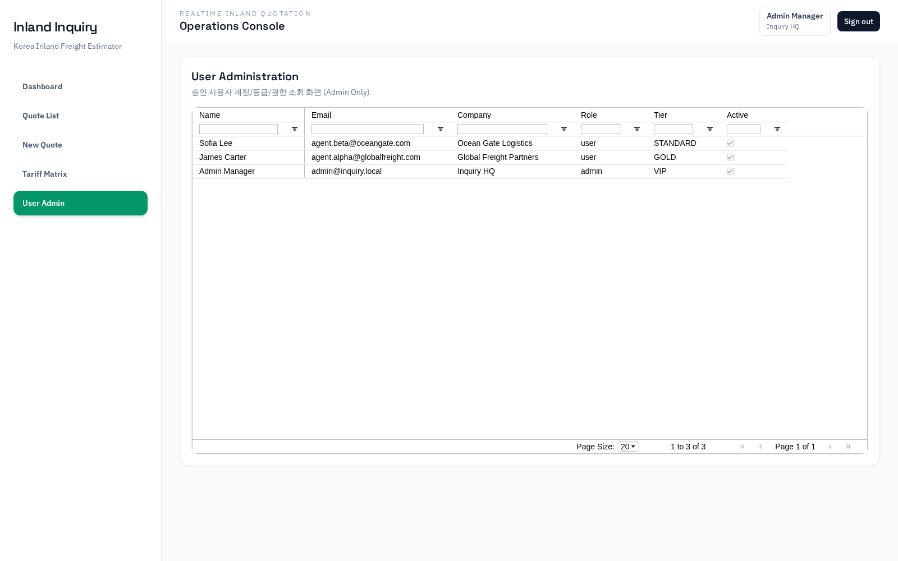
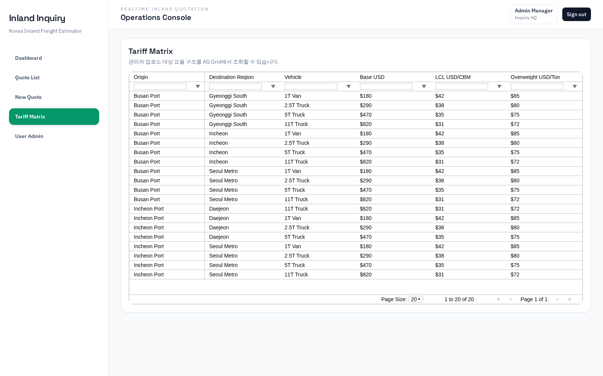

# Inland Freight Inquiry System

해외 파트너사(에이전트)가 한국 도착 수입 화물의 내륙 운송비를 실시간으로 조회하고 견적을 발행할 수 있는 B2B 웹 시스템입니다.

## 1. 구현 목표와 반영 내용

기존 과업 요구사항을 기준으로 아래 항목을 실제 동작 가능한 형태로 구현했습니다.

- `React + Tailwind` 기반 FE (반응형)
- `FastAPI + PostgreSQL` 기반 BE/DB
- `JWT 인증` 및 시드 사용자 3명
- 운임 계산 핵심 로직
  - 차량 제원 기반 자동 차종 매칭
  - LCL vs FTL 자동 비교
  - 중량/사이즈 할증
  - 회원 등급 할인
  - 환율 반영(USD -> KRW)
- 목록형 화면은 `AG Grid Community` 적용
- `Docker Compose`로 전체 서비스 일괄 실행
- `Mermaid Flow`, `ERD`, 주요 화면 5장 캡처 포함

## 2. 기술 스택

- Frontend: React 19, Vite, Tailwind CSS, AG Grid Community, React Router
- Backend: FastAPI, SQLAlchemy, JWT(python-jose), Passlib
- Database: PostgreSQL 16
- Infra: Docker, Docker Compose, Nginx

## 3. 시스템 아키텍처



## 4. 운임 계산 Flow (Mermaid)

```mermaid
flowchart TD
  A[입력: 패키지/중량/CBM/LWH/도착지] --> B[차량 제원 조회]
  B --> C{적재 가능 차량 존재?}
  C -- Yes --> D[최소 적합 차종 선택]
  C -- No --> E[최대 차종 선택 + 사이즈 할증]
  D --> F[요율표 조회]
  E --> F
  F --> G[LCL 비용 계산]
  F --> H[FTL 비용 계산]
  G --> I{최소 비용 선택}
  H --> I
  I --> J[중량/사이즈 할증 반영]
  J --> K[회원 등급 할인 반영]
  K --> L[환율(USD->KRW) 반영]
  L --> M[견적 번호 발행 및 저장]
```

## 5. ERD (Mermaid)



## 6. 주요 기능

### 6.1 회원/인증

- JWT 기반 로그인
- 시드 사용자 3명 (Admin 1, Agent 2)
- 권한 분기
  - Admin: 전체 견적, 사용자 관리 화면 접근
  - User: 본인 견적만 조회

### 6.2 견적 Core Logic

- 화물 정보 입력 기반 자동 견적 발행
- 차량 적재 가능 여부 판정
- 요율표 기반 FTL/LCL 자동 비교
- 중량/사이즈 할증 및 등급 할인 적용
- 환율 반영 KRW 금액 동시 제공

### 6.3 선택 기능 (AI 입력 대체 경량 구현)

- `/api/quotes/parse-text` 엔드포인트
- 이메일/메신저 텍스트를 붙여넣으면 견적 입력 필드 초안 파싱

## 7. 주요 화면 캡처 (5장)

### 7.1 Dashboard



### 7.2 Quote List (AG Grid)



### 7.3 New Quote + Result



### 7.4 Admin Users (AG Grid)



### 7.5 Tariff Matrix (AG Grid)



## 8. 실행 방법 (Docker)

### 8.1 시작

```bash
docker compose up -d --build
```

### 8.2 접속 URL

- Frontend: http://localhost:9000
- Backend API: http://localhost:8000
- API Docs(Swagger): http://localhost:8000/docs

### 8.3 기본 계정 (JWT)

- Admin
  - email: `admin@inquiry.local`
  - password: `Admin123!`
- Agent A
  - email: `agent.alpha@globalfreight.com`
  - password: `Agent123!`
- Agent B
  - email: `agent.beta@oceangate.com`
  - password: `Agent123!`

### 8.4 종료

```bash
docker compose down
```

데이터까지 제거하려면:

```bash
docker compose down -v
```

### 8.5 화면 캡처 재생성

```bash
docker run --rm --network host -v "$PWD":/work -w /work \
  mcr.microsoft.com/playwright:v1.58.2-jammy \
  bash -lc "cd /tmp && npm init -y >/dev/null 2>&1 && npm install playwright@1.58.2 >/dev/null 2>&1 && NODE_PATH=/tmp/node_modules node /work/scripts/capture-screens.cjs"
```

## 9. 주요 API 요약

- `POST /api/auth/login`
- `GET /api/auth/me`
- `GET /api/dashboard/summary`
- `GET /api/quotes`
- `POST /api/quotes/calculate`
- `POST /api/quotes/parse-text`
- `GET /api/reference/vehicles`
- `GET /api/reference/tariffs`
- `GET /api/reference/exchange-rate`
- `GET /api/admin/users` (Admin)

## 10. 프로젝트 구조

```text
.
├─ backend/
│  ├─ app/
│  │  ├─ core/            # 설정/보안
│  │  ├─ routers/         # API 라우터
│  │  ├─ services/        # 견적 계산/파싱 로직
│  │  ├─ models.py        # SQLAlchemy 모델
│  │  ├─ schemas.py       # Pydantic 스키마
│  │  ├─ seed.py          # 시드 데이터
│  │  └─ main.py          # FastAPI 엔트리
│  └─ Dockerfile
├─ src/                   # React + Tailwind FE
├─ nginx/default.conf     # SPA + /api reverse proxy
├─ docker-compose.yml
├─ Dockerfile.frontend
└─ captures/              # 주요 화면 캡처 5장
```
