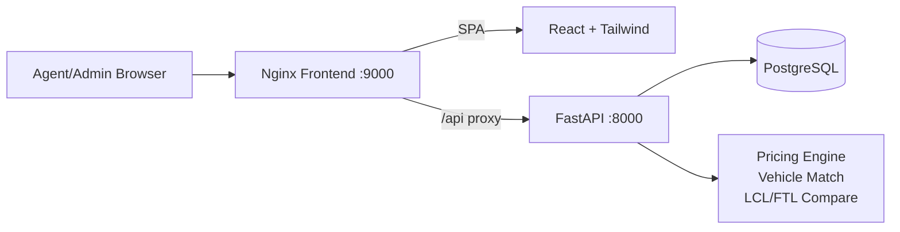
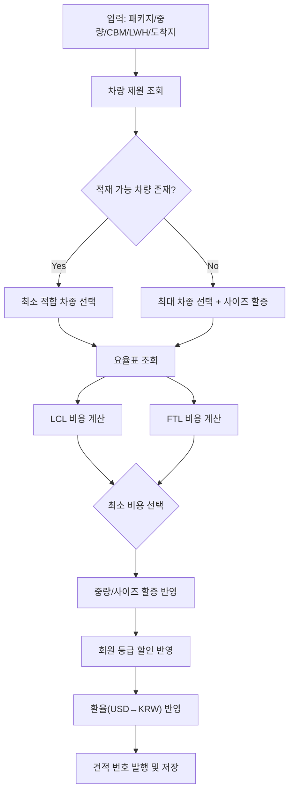
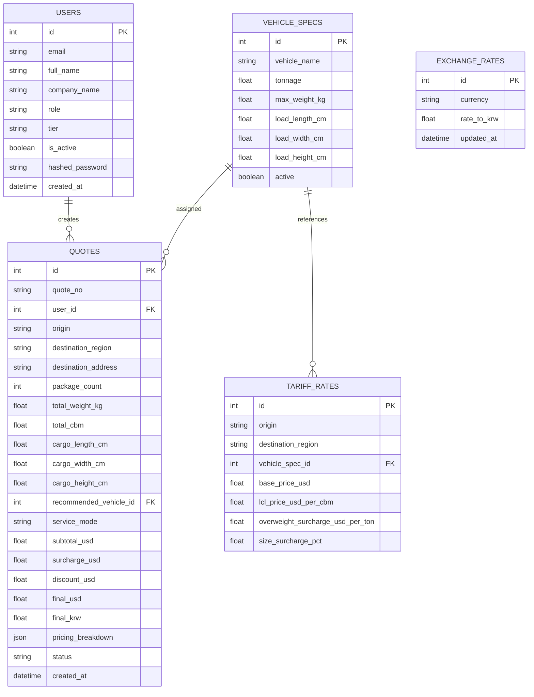

# Inland Freight Inquiry System

해외 파트너사(에이전트)가 한국 도착 수입 화물의 내륙 운송비를 실시간으로 조회하고 견적을 발행할 수 있는 B2B 웹 시스템입니다.

## 1. 구현 목표와 반영 내용

기존 과업 요구사항을 기준으로 아래 항목을 실제 동작 가능한 형태로 구현했습니다.

- `React + Tailwind` 기반 FE (반응형)
- `FastAPI + PostgreSQL` 기반 BE/DB
- `JWT 인증` 및 시드 사용자 3명
- 운임 계산 핵심 로직
  - 차량 제원 기반 자동 차종 매칭
  - LCL vs FTL 자동 비교
  - 중량/사이즈 할증
  - 회원 등급 할인
  - 환율 반영(USD -> KRW)
- 목록형 화면은 `AG Grid Community` 적용
- `Docker Compose`로 전체 서비스 일괄 실행
- `Mermaid Flow`, `ERD`, 주요 화면 5장 캡처 포함

## 2. 기술 스택

- Frontend: React 19, Vite, Tailwind CSS, AG Grid Community, React Router
- Backend: FastAPI, SQLAlchemy, JWT(python-jose), Passlib
- Database: PostgreSQL 16
- Infra: Docker, Docker Compose, Nginx

## 3. 시스템 아키텍처



## 4. 운임 계산 Flow (Mermaid)



## 5. ERD (Mermaid)



## 6. 주요 기능

### 6.1 회원/인증

- JWT 기반 로그인
- 시드 사용자 3명 (Admin 1, Agent 2)
- 권한 분기
  - Admin: 전체 견적, 사용자 관리 화면 접근
  - User: 본인 견적만 조회

### 6.2 견적 Core Logic

- 화물 정보 입력 기반 자동 견적 발행
- 차량 적재 가능 여부 판정
- 요율표 기반 FTL/LCL 자동 비교
- 중량/사이즈 할증 및 등급 할인 적용
- 환율 반영 KRW 금액 동시 제공

### 6.3 선택 기능 – RAG-lite 텍스트 파싱 (AI 입력 대체 경량 구현)

- `/api/quotes/parse-text` 엔드포인트
- 이메일/메신저 텍스트를 붙여넣으면 견적 입력 필드 초안 파싱
- 패턴 기반 추출(Regex RAG-lite)이며 신뢰도(confidence) 스코어를 함께 반환
- 응답에 `legal_disclaimer` 필드가 포함되며 UI에 경고 배너로 표시됨

> **⚠️ 법적 고지 (Legal Disclaimer)**
>
> `parse-text` 기능은 입력 텍스트를 패턴 매칭 방식으로 자동 파싱한 **참고용 데이터**만 제공합니다.
> 파싱 결과는 법적 구속력이 없으며, 실제 운송 계약 체결 전 모든 수치(중량·용적·주소 등)를
> 반드시 사용자가 직접 확인해야 합니다.
> 입력된 원문 텍스트는 서버에 저장되지 않으며 제3자에게 제공되지 않습니다.

## 7. 주요 화면 캡처 (5장)

### 7.1 Dashboard


### 7.2 Quote List (AG Grid)


### 7.3 New Quote + Result


### 7.4 Admin Users (AG Grid)


### 7.5 Tariff Matrix (AG Grid)


## 8. 실행 방법 (Docker)

### 8.1 시작

```bash
docker compose up -d --build
```

### 8.2 접속 URL

- Frontend: http://localhost:9000
- Backend API: http://localhost:8000
- API Docs(Swagger): http://localhost:8000/docs

### 8.3 기본 계정 (JWT)

- Admin
  - email: `admin@inquiry.local`
  - password: `Admin123!`
- Agent A
  - email: `agent.alpha@globalfreight.com`
  - password: `Agent123!`
- Agent B
  - email: `agent.beta@oceangate.com`
  - password: `Agent123!`

### 8.4 종료

```bash
docker compose down
```

데이터까지 제거하려면:

```bash
docker compose down -v
```

### 8.5 화면 캡처 재생성

```bash
docker run --rm --network host -v "$PWD":/work -w /work \
  mcr.microsoft.com/playwright:v1.58.2-jammy \
  bash -lc "cd /tmp && npm init -y >/dev/null 2>&1 && npm install playwright@1.58.2 >/dev/null 2>&1 && NODE_PATH=/tmp/node_modules node /work/scripts/capture-screens.cjs"
```

### 8.6 Air-Gap(폐쇄망) 환경 실행

인터넷이 차단된 환경에서 실행하려면 두 단계를 거칩니다.

#### 8.6.1 인터넷 연결 머신에서 번들 생성

```bash
# 1. 이미지 빌드 + tar 저장, Python wheel, npm 패키지 모두 준비
bash scripts/airgap-save.sh
```

생성 결과:

| 파일/디렉터리 | 설명 |
|---|---|
| `airgap-bundle/images/*.tar` | Docker 이미지 tar 아카이브 |
| `backend/vendor/*.whl` | Python 패키지 wheel |
| `npm-offline-cache/` | npm 오프라인 캐시 |

#### 8.6.2 폐쇄망 머신에서 실행

```bash
# 2. 저장된 이미지 로드
bash scripts/airgap-load.sh

# 3. air-gap 전용 Compose 실행 (빌드 없이 로드된 이미지 사용)
docker compose -f docker-compose.yml -f docker-compose.airgap.yml up -d
```

> **참고**: `docker-compose.airgap.yml`은 빌드 단계를 건너뛰고 로컬에 로드된
> 이미지를 직접 참조합니다. 재빌드가 필요한 경우 `Dockerfile`의
> `AIRGAP=1` 빌드 인수를 사용하면 `backend/vendor/` 의 wheel과
> `npm-offline-cache/` 캐시에서만 패키지를 설치합니다.

## 9. 주요 API 요약

- `POST /api/auth/login`
- `GET /api/auth/me`
- `GET /api/dashboard/summary`
- `GET /api/quotes`
- `POST /api/quotes/calculate`
- `POST /api/quotes/parse-text` — 응답에 `legal_disclaimer` 포함
- `GET /api/reference/vehicles`
- `GET /api/reference/tariffs`
- `GET /api/reference/exchange-rate`
- `GET /api/admin/users` (Admin)

## 10. 프로젝트 구조

```text
.
├─ backend/
│  ├─ app/
│  │  ├─ core/            # 설정/보안
│  │  ├─ routers/         # API 라우터
│  │  ├─ services/        # 견적 계산/파싱 로직
│  │  ├─ models.py        # SQLAlchemy 모델
│  │  ├─ schemas.py       # Pydantic 스키마
│  │  ├─ seed.py          # 시드 데이터
│  │  └─ main.py          # FastAPI 엔트리
│  └─ Dockerfile
├─ src/                   # React + Tailwind FE
├─ nginx/default.conf     # SPA + /api reverse proxy
├─ docker-compose.yml
├─ docker-compose.airgap.yml  # air-gap 환경 오버라이드
├─ Dockerfile.frontend
├─ scripts/
│  ├─ airgap-save.sh      # 폐쇄망 번들 생성 (인터넷 연결 머신)
│  └─ airgap-load.sh      # 폐쇄망 이미지 로드
└─ captures/              # 주요 화면 캡처 5장
```

## 11. RAG 텍스트 파싱 – 법적 고지 전문

본 시스템의 `/api/quotes/parse-text` 엔드포인트(이하 "파싱 기능")는 운송 요청 텍스트에서 화물 정보를 자동 추출하는 기능을 제공합니다. 이 기능 사용 전 다음 법적 고지를 반드시 숙지하시기 바랍니다.

### 11.1 면책 사항 (Disclaimer of Warranties)

1. **정확성 보장 불가**: 파싱 기능은 정규식 패턴 매칭 기반으로 동작하며, 입력 텍스트의 형식·언어·오탈자 등에 따라 결과가 부정확할 수 있습니다.
2. **법적 구속력 없음**: 파싱 결과는 견적 입력 초안 제공을 목적으로 하며, 어떠한 법적 효력도 갖지 않습니다. 운송 계약의 조건은 최종 발행된 견적서(`/api/quotes/calculate` 응답)에 한해 유효합니다.
3. **사용자 확인 의무**: 파싱된 수치(중량·용적·치수·주소 등)는 계약 체결 전 반드시 사용자가 원본 문서와 대조·확인하여야 합니다.

### 11.2 개인정보 및 데이터 처리 (Data Privacy)

1. **비저장 원칙**: 파싱 엔드포인트로 전송된 원문 텍스트(`raw_text`)는 서버 메모리에서 처리 후 즉시 폐기되며, 데이터베이스에 저장되지 않습니다.
2. **제3자 비제공**: 원문 텍스트는 외부 AI 서비스 또는 제3자에게 전달되지 않습니다.
3. **로그 최소화**: 서버 로그에는 요청 메타데이터(시각, 사용자 ID)만 기록되며 원문 내용은 포함되지 않습니다.

### 11.3 지식재산권 및 준거법 (IP & Governing Law)

1. **저작권**: 사용자가 파싱 기능에 제출하는 텍스트의 저작권은 해당 문서의 원저작권자에게 귀속됩니다. 당사는 파싱 처리 이외의 목적으로 해당 텍스트를 사용하지 않습니다.
2. **준거법**: 본 법적 고지는 대한민국 법률을 준거법으로 하며, 분쟁 발생 시 서울중앙지방법원을 제1심 전속관할 법원으로 합니다.

> 이 고지는 시스템 업데이트 시 변경될 수 있으며, 변경된 내용은 API 응답의 `legal_disclaimer` 필드를 통해 최신 버전이 항상 제공됩니다.
